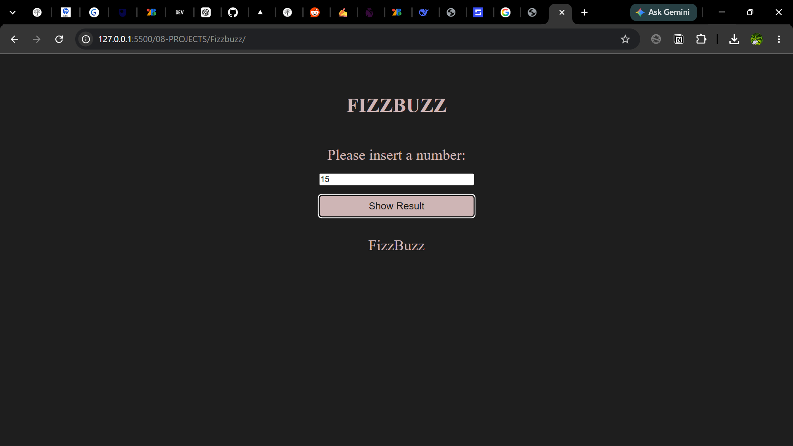

This is my first project in a while:
    the logic is simple- create a program that scans for the following;

    Start at 1
        |
        |
        |

    For every number:
    Is it divisible by 3 AND 5?
        Yes → FizzBuzz

    Otherwise, is it divisible by 3?
        Yes → Fizz

    Otherwise, is it divisible by 5?
        Yes → Buzz

    Otherwise:
        Print the number

1. Project Title
2. Project Description
3. Preview / Screenshot
4. Features
5. Tech Stack
6. How It Works
7. Installation / Setup
8. Usage
9. What I Learned
10. Challenges & Solutions
11. Future Improvements
12. Author

## Markdown

Fizzbuzz Game

**Description**
A simple interactive fizzbuzz web application built with HTML, CSS, JAVASCRIPT.

**PREVIEW**

## Features
- Accepts the user inputs
- Validates the user input
- Returns fizzbuzz, fizz, or buzz after validation
- displays results dynamically
- Handles incorrect input well.

## TECH STACK
- HTML5
- CSS3
- JAVASCRIPT

## HOW IT WORKS
- User inserts an number in the input field
- the value is initially a string but later converted to a number using parseFloat()
- The input is stored and evaluated/checked for validity
- the program checks if the number is divisible by 3 or 5 or both.
- The appropriate result is displayed on the page in distinct style.

## REPO LINK
https://github.com/boluucodes/javascript--learning.git

## LIVELINK
https://boluucodes.github.io/javascript--learning/08-PROJECTS/Fizzbuzz/

## USAGE
 
- Enter a number between 1 and 100
- click the "show result" button
- the app displays the result
  
## What I Learned

Through this project, I practiced:

- JavaScript functions
- Conditional statements
- DOM manipulation
- Event listeners

## Future Improvements
- Add a function to determine user's proximity to the correct answer.
- Improve animations
- Improve mobile responsiveness
- Add Feedback

## AUTHOR

**BOLUWATIFE KEHINDE**
- GITHUB:[Boluucodes] (https://github.com/boluucodes)
